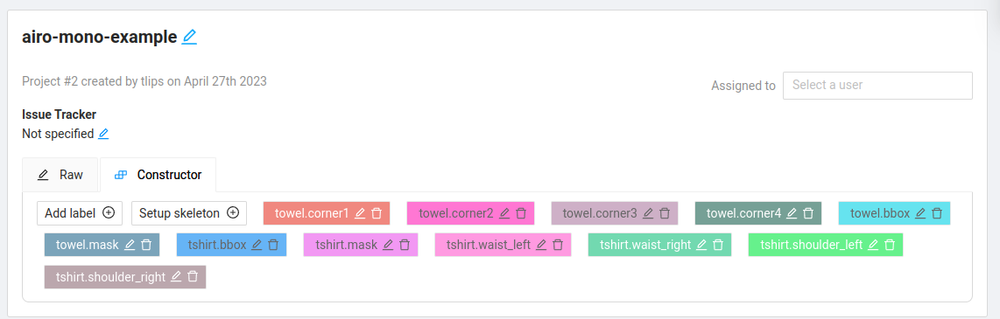

# CVAT for labeling data
This module contains code and documentation for the workflow we use to label image data using [CVAT](https://www.cvat.ai/)

why CVAT? There are a number of other tools available. We want the tool to be open-source, free to use, easy to host, and support as many formats as possible. CVAT has all these features, but the same goes for [LabelStudio](https://labelstud.io/) which would be a valid alternative.

This document describes the main steps, for more details you should take a look at the CVAT documentation [here](https://opencv.github.io/cvat/docs/)
## Usage
### connecting to CVAT on local device (AIRO-only)
We run a CVAT server on the `paard` workstation. If you have an account and are connected to the ELIS-network, you can forward CVAT's port to your device using `ssh -L 127.0.0.1:8080:paard:8080 <username>@paard`. You can now browse in chrome  to `localhost:8080` and log in to CVAT.
### adding users
Creating seperate user accounts makes it easier to assign stuff and to see who did what. Go the the Django Backend to create new users.

### creating COCO Keypoint datasets
This section describes the flow we use at AIRO to create COCO Keypoints datasets with CVAT. An example dataset and the resulting COCO file can be found [here](example/).

The flow supports multiple categories, multiple instaces of a category in a single image and 'symmetric' semantic locations (keypoints), such as the 4 corners of a towel.
#### Project Setup
We use a local share to access local datasets, so make sure your dataset is on the `/storage` mount on `paard`. Then go to cvat and create a new project.
The label setup should be as follows:
- each category has a prefix <category_name>, that is added as <category_name>.<label-name> in CVAT to all labels for that category.
- for each category, you should add a label for each keypoint, and optionally also for the bounding box and or segmentation mask.
- if you have 'symmetric keypoints', you should label them as <category_name>.<label_name><idx> with idx = 0,...,N. You don't need to label them consistently in any way, just make sure that you label each semantic location with a separate label id.
For the example, with two categories: towels and tshirts, this looks as follows:

- If you have multiple instances of one item in an image, you have to [group](https://opencv.github.io/cvat/docs/manual/advanced/shape-grouping/) them manually in CVAT.
Now you can create new task by selecting the files from the local share:

Note that the files can have arbitrary nested structures, but cvat does not accept non-image files in those folders. If you do have other file types, you will have to make a separate 'view' of the dataset with the same folder structure that only contains the image files.

#### Labeling
some tips for labeling:
- easier to label 1 label for the entire dataset and then do another label instead of switching between labels.
- save every now and then
- test the conversion script early enough to avoid wasting label effort.

### Converting cvat annotations to COCO annotations
Once you have the cvat annotations you can export them under the `CVAT Images 1.1` format, which will generate an xml file. This xml file can then be converted to a COCO Keypoints dataset, using the CLI of this package: `airo-dataset-tools convert-cvat-to-coco-keypoints <xml-file-path>`.

You can then visualize the dataset with Fiftyone using the CLI, see `airo-dataset-tools fiftyone-coco-viewer --help`.
For the example in this module, it would look like this:
.

## CVAT installation
- follow the steps [here](https://opencv.github.io/cvat/docs/administration/basics/installation/) to clone the repo and install the dependencies.
- add local share for your mount where you by creating an `docker-compose-override.yml` file, as described [here](https://opencv.github.io/cvat/v1.6.0/docs/administration/basics/installation/#share-path)
- run `CVAT_VERSION=<your-version> docker-compose up -d` to start CVAT. It will restart if the containers have been shut down (e.g. when rebooting) so it should be always up and running.
- create a superuser as described [here](https://opencv.github.io/cvat/docs/administration/basics/admin-account/).
- start using cvat by browsing to [localhost:8080](localhost:8080).

