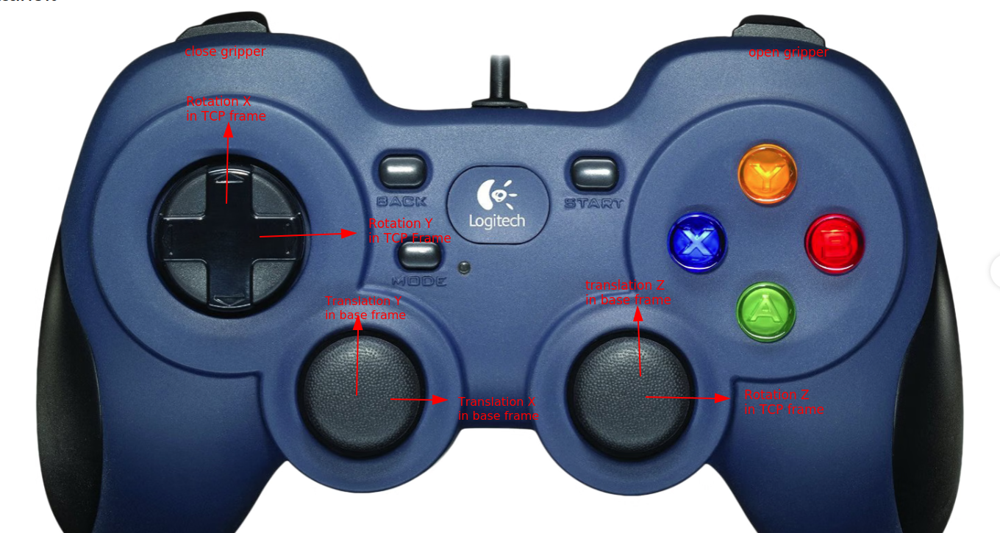

# Airo-teleop


This package contains code for teleoperating robots and grippers.

This can be useful for a number of things:

- collect demonstrations to train policies (no code is available atm to conveniently store the actions atm though)
- manually do parts of a manipulation task to test the policies for other parts of that task
- get a feeling for the difficulty of manipulation tasks
- ...

Currently, only game controllers are supported, and only on Linux systems.

package structure:
```
airo_teleop/
    explore_pygame_game_controller_mapping.py       # pygame example code to see what pygame gets from the controllers.
    game_controller_mapping.py                      # configurations to map the pygame axes to the physical elements on the controllers
    game_controller_teleop.py                       # code to convert game controller inputs into commands for robot.
    docs/
    test/                                           #placeholder since there are no tests

```

## Usage
### Game Controller Teleop

1. Connect your controller to the pc.
2. Connect to the robot (and gripper) using the `airo-robots` interfaces
3. create a teleop instance by passing your controller layout, reference to the robot and desired control rate
4. start teleoperating

code snippet below, see `scripts/game_controller_teleop_example.py` for a CLI script to quickly test or get acquainted with the game controller teleop functionality.

```python
control_rate = 10 # number of steps / second
robot = ...
layout = the appropriate GameControllerLayout

joystick_teleop = GameControllerTeleop(robot, control_rate, layout)
# start teleoperating, from now on you can use the controller
# to move the robot, untill you press CTRL+C
joystick_teleop.teleoperate()
```

The image below shows how the controller is mapped to the robot. Note that translations are expressed in the base frame (so the axes remain constant), whereas rotations are expressed in the TCP frame as this is easier to reason about.


It makes most sense to position yourself 'in front' of the robot, meaning that you look in the +y direction with the +x to the right.




### adding new teleoperation input devices

currently there is no base class abstraction provided for this, so at the moment we want to do this we should think about base class and then implement that for all input modalities.
